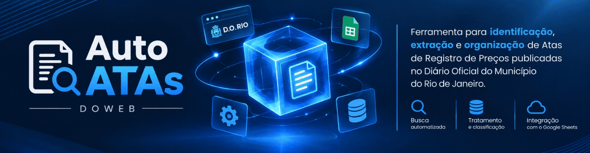
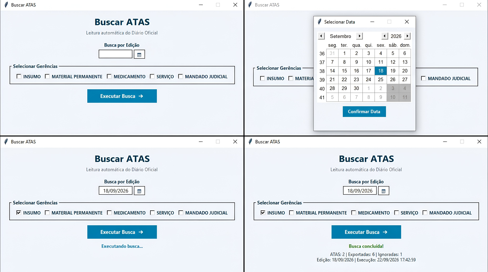
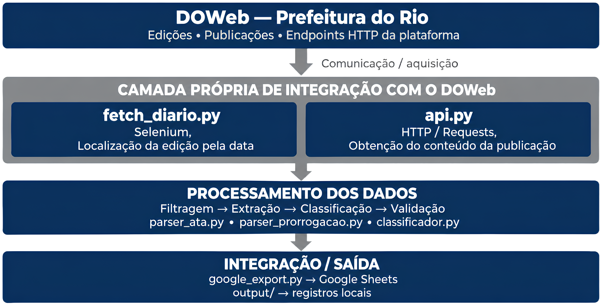

<h1 align="center">Auto-Atas-DOWeb</h1>

<p align="center">
  <strong>Automação para busca, processamento, classificação e consolidação de Atas de Registro de Preços</strong><br>
  <sub> Com foco nas publicações da Secretaria Municipal de Saúde no Diário Oficial do Município do Rio de Janeiro </sub>
</p>

<p align="center">
  
  
  
</p>


<p align="center">
  
</p>

---

## Visão geral

O **Auto-Atas-DOWeb** automatiza etapas do processo de identificação e tratamento de publicações no Diário Oficial do Município do Rio de Janeiro, reduzindo atividades manuais relacionadas à localização, organização e consolidação das informações das Atas de Registro de Preços.

A aplicação consulta as publicações, identifica aquelas relacionadas à **Secretaria Municipal de Saúde**, extrai e estrutura os dados relevantes, classifica os registros e realiza a exportação das informações para o **Google Sheets**.

---

## Objetivo

O objetivo da ferramenta é reduzir o esforço operacional empregado na identificação e organização de Atas de Registro de Preços, proporcionando maior **padronização, rastreabilidade e agilidade** no tratamento das informações.

---

## Principais funcionalidades

| Funcionalidade | Descrição |
|---|---|
| 🔎 **Consulta** | Busca automatizada de publicações no Diário Oficial |
| 🏥 **Identificação** | Filtragem das publicações relacionadas à Secretaria Municipal de Saúde |
| 📄 **Extração** | Estruturação das informações relevantes das Atas |
| 🗂️ **Classificação** | Classificação dos registros por códigos de materiais e análise textual contextual |
| 🔄 **Prorrogações** | Identificação e tratamento de publicações de prorrogação |
| ♻️ **Deduplicação** | Verificação de registros já existentes antes da inserção |
| 📊 **Exportação** | Consolidação dos dados no Google Sheets |
| 📝 **Rastreabilidade** | Registro das informações e resultados da execução |

---

## Fluxo de funcionamento

O processamento da ferramenta é organizado em etapas sequenciais, desde a seleção dos parâmetros pelo usuário até a consolidação dos resultados.

```mermaid
flowchart LR
    classDef default fill:#3776AB,color:#FFF,stroke:#FFF;
    linkStyle default stroke:#FFF,stroke-width:2px;

    A[Usuário<br/>seleciona data e categorias] --> B[Consulta ao<br/>Diário Oficial]
    B --> C[Identificação das<br/>publicações da SMS]
    C --> D[Extração e<br/>tratamento dos dados]
    D --> E[Classificação<br/>dos registros]
    E --> F[Tratamento de<br/>prorrogações]
    F --> G[Deduplicação e<br/>atualização]
    G --> H[Exportação para<br/>Google Sheets]
    H --> I[Registro da<br/>execução e logs]
```


## Interface da aplicação

A ferramenta possui uma interface gráfica desenvolvida em **Python/Tkinter**, permitindo ao usuário selecionar a data da publicação e definir, no campo **"Buscar por"**, as categorias que serão consideradas durante a execução.

A aplicação também apresenta mensagens de validação e informações sobre o resultado da execução, incluindo a quantidade de registros identificados, exportados e ignorados.

A captura abaixo reúne alguns dos principais estados da aplicação: tela inicial, seleção de data, validação da seleção e conclusão da busca:

<p align="center">
  
</p>

---

## Requisitos

Para executar a ferramenta, são necessários:

- Python 3.10 ou superior;
- Google Chrome instalado;
- Conexão ativa com a internet;
- Google Sheets API habilitada;
- Conta de Serviço configurada;
- Arquivo de credenciais `credentials.json`;
- Planilha do Google Sheets compartilhada com a Conta de Serviço com permissão de edição.

A aplicação utiliza o **Selenium Manager** para gerenciamento automático do WebDriver compatível com o navegador instalado, não sendo necessária a instalação ou manutenção manual de um arquivo ChromeDriver.

---

## Instalação

Clone o repositório e acesse a pasta do projeto:

```bash
git clone https://github.com/Mth7z/Auto-Atas-DOWeb.git
cd Auto-Atas-DOWeb
```

Crie um ambiente virtual:

```bash
python -m venv .venv
```

Ative o ambiente virtual e instale as dependências:

```bash
pip install -r requirements.txt
```

---

## Configuração

A aplicação utiliza arquivos de configuração locais para armazenar informações que não devem ser versionadas.

> **Aviso:** arquivos como `credentials.json` e `src/config_local.py` podem conter informações sensíveis e não devem ser enviados.

### Google Cloud e Google Sheets

1. Configure uma Conta de Serviço no Google Cloud.
2. Habilite a Google Sheets API.
3. Salve o arquivo de credenciais como `credentials.json` na raiz do projeto.
4. Compartilhe a planilha utilizada pela aplicação com o endereço de e-mail da Conta de Serviço.
5. Conceda à Conta de Serviço permissão de **Editor** na planilha.

### Configuração local

Copie o arquivo de configuração de exemplo:

```bash
cp src/config_local.example.py src/config_local.py
```

Abra o arquivo `src/config_local.py` e configure os parâmetros necessários, incluindo a identificação da planilha e o nome da aba utilizada pela aplicação.

Exemplo:

```python
SPREADSHEET_KEY = "ID_DA_PLANILHA"
WORKSHEET_NAME = "NOME_DA_ABA"
```

---

## Execução

### Interface gráfica

Para iniciar a aplicação pela interface gráfica:

```bash
python run.py
```

A interface permite selecionar a data da publicação e as categorias que deverão ser consideradas durante a execução.

### Linha de comando

Para executar a ferramenta diretamente pelo terminal:

```bash
python -m src.main
```

Também é possível informar parâmetros específicos:

```bash
python -m src.main --data 18/09/2026 --categorias INSUMO
```

---

## Arquivos de saída

Durante a execução, a ferramenta gera arquivos locais de acompanhamento e processamento na pasta `output/`.

Entre os principais arquivos estão:

| Arquivo | Finalidade |
|---|---|
| `output/atas.json` | Dados estruturados das Atas e demais registros processados |
| `output/log_execucao.json` | Informações e resultados da execução |

Esses arquivos permitem acompanhar o processamento realizado e fornecem informações úteis para rastreabilidade e análise de eventuais ocorrências.

---

## Arquitetura e Funcionamento

A aplicação possui dois modos de execução:

- **Interface Gráfica (GUI):** destinada à utilização interativa da ferramenta;
- **Linha de Comando (CLI):** destinada à execução por parâmetros e outros cenários que não dependam da interface gráfica.

### Camada de integração com o DOWeb

A aplicação implementa uma camada própria de integração com os endpoints disponibilizados pela plataforma DOWeb. O Selenium é utilizado na etapa de navegação e localização da edição correspondente à data informada, enquanto as requisições HTTP são utilizadas para obtenção programática do conteúdo das publicações.

Essa separação permite utilizar a automação de navegador para localização das informações e, posteriormente, realizar o processamento do conteúdo por meio de requisições programáticas.

Os dados obtidos são posteriormente processados pelas camadas de extração, classificação e tratamento de ATAs e prorrogações, sendo os resultados integrados ao **Google Sheets**.

A organização dessa arquitetura permite separar a etapa de aquisição das informações das etapas de processamento e saída, facilitando a manutenção e a evolução dos componentes da ferramenta.

### Fluxo técnico de integração

<p align="center">
  
</p>

---

## Estrutura do projeto

A estrutura principal da aplicação é organizada da seguinte forma:

```text
Auto-Atas-DOWeb/
│
├── assets/
│   └── media/
│       ├── auto-atas-banner.gif
│       ├── interface-gui.jpeg
│       └── fluxo-técnico-de-integração.png
│
├── output/
│
├── src/
│   ├── __init__.py
│   ├── api.py
│   ├── classificador.py
│   ├── config_local.example.py
│   ├── config.py
│   ├── fetch_diario.py
│   ├── google_export.py
│   ├── gui.py
│   ├── main.py
│   ├── parser_ata.py
│   └── parser_prorrogacao.py
│
├── .gitignore
├── LICENSE
├── README.md
├── requirements.txt
└── run.py
```

### Principais componentes

| Arquivo | Função |
|---|---|
| `run.py` | Ponto de entrada da aplicação pela interface gráfica |
| `src/gui.py` | Interface gráfica desenvolvida em Tkinter |
| `src/main.py` | Orquestração principal do processamento |
| `src/fetch_diario.py` | Navegação automatizada e consulta ao D.O. Rio |
| `src/api.py` | Obtenção do conteúdo das publicações por requisição |
| `src/parser_ata.py` | Extração e tratamento dos dados das Atas |
| `src/parser_prorrogacao.py` | Extração e tratamento das informações de prorrogações |
| `src/classificador.py` | Classificação dos registros por categoria |
| `src/google_export.py` | Integração e exportação dos dados para o Google Sheets |
| `src/config.py` | Configurações gerais da aplicação |
| `output/` | Armazenamento local dos arquivos gerados durante a execução |

---

## Processamento e classificação

A ferramenta normaliza os textos extraídos das publicações e realiza a classificação dos registros por meio de uma combinação de regras determinísticas e análise textual contextual.

A classificação segue uma ordem de prioridade, buscando utilizar primeiro as informações mais específicas e confiáveis disponíveis:

1. **Código de material / classe SIGMA:** os quatro primeiros dígitos do código de material possuem prioridade máxima quando correspondem a uma classe configurada;
2. **Classe identificada no texto:** quando a publicação apresenta explicitamente uma classe de material, essa informação também pode ser utilizada na classificação;
3. **Especificação do item:** são analisados termos e expressões presentes na especificação, que recebe maior peso por descrever diretamente o item;
4. **Objeto da contratação:** utilizado como evidência complementar para identificar a natureza da aquisição ou contratação;
5. **Classificação desconhecida:** quando não existem evidências suficientes para uma classificação segura, o registro é mantido como `desconhecido`.

Na versão atual, os registros podem ser classificados nas seguintes categorias:

- `INSUMO`
- `MEDICAMENTO`
- `MANDADO JUDICIAL`
- `SERVIÇO`
- `MATERIAL PERMANENTE`

A classificação por código possui prioridade sobre a análise textual. Dessa forma, códigos de materiais previamente mapeados podem determinar diretamente a categoria do registro, enquanto a análise textual atua como mecanismo complementar.

A ferramenta também utiliza pontuação para ponderar diferentes evidências textuais, permitindo distinguir termos mais específicos de evidências contextuais.

Quando não há evidência suficiente para determinar uma categoria, o registro pode permanecer como `desconhecido`, evitando uma classificação arbitrária.

---

## Tratamento de prorrogações

Além das novas Atas, a ferramenta identifica e processa publicações relacionadas a prorrogações.

São extraídas as informações necessárias para relacionar a prorrogação à Ata correspondente, incluindo:

- número da Ata e informações relacionadas ao pregão;
- processo de prorrogação, quando identificado na publicação;
- códigos de materiais;
- razão social da empresa;
- informações relacionadas à vigência.

Quando aplicável, essas informações são encaminhadas ao módulo responsável pela atualização dos registros na planilha.

---

## Deduplicação e atualização

A ferramenta verifica os registros existentes na planilha antes da inserção de novos dados, reduzindo a ocorrência de duplicidades.

Quando uma nova publicação corresponde a um registro já existente, a aplicação utiliza as informações previamente cadastradas para evitar a criação desnecessária de novas linhas.

No caso de prorrogações, as informações são associadas às Atas correspondentes e a data de vencimento pode ser atualizada no registro existente.

---

## Evolução do projeto

A versão atual estabelece a base da ferramenta para automatização da busca, processamento, classificação e consolidação das informações.

Novos aprimoramentos e funcionalidades estão previstos para versões futuras, acompanhando a evolução das necessidades do processo e da própria aplicação.

---

## Licença

Este projeto é distribuído sob a licença **MIT**.

Consulte o arquivo [`LICENSE`](LICENSE) para acessar o texto completo da licença.

Copyright (c) 2026 Matheus Cândido Vieira.

---

<p align="center">
  <sub>Auto-Atas-DOWeb • Release v1.0.0</sub>
</p>